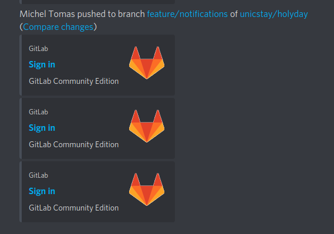
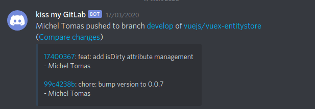

# Webhook Transfer

A dead-simple Express.js server to forward a single POST payload to an unlimited number of webhooks.

## What it does
Here at *kiss my*, we use it for our GitLab (on-premise) / Slack / Discord integrations: GitLab's Discord integration sends really badly formatted messages like this one:  

 

while using the Slack integration + a Slack formatted webhook in Discord (by adding `/slack` to the webhook's URL) looks like this:  

Much more useful!

**It's also very useful to easily send Slack notifications from a single project to an unlimited number of Slack workspaces :)**

## How it works
Instead of having only one URL per GitLab integration, you hit `/relay` on this server's hostname and pass multiple webhook URLs in the `urls[]` query param.  

So if you have say 2 webhooks:  
* `https://hooks.slack.com/some/token`  
* `https://discordapp.com/api/webhooks/some/other/token/slack` (the `/slack` part is mandatory to use the Slack integration)

And you've deployed this app to `https://my-webhook-proxy.example.com`

Now follow these steps:  
* Convert those two webhook URLs to URL parameters. You can do so using [the great URLencoder free tool](https://www.urlencoder.org/), or any other tool.  
* Use the encoded webooks in the query string to the Transfer app: `https://my-webhook-proxy.example.com/relay?urls[]=encodedURL1&urls[]=encodedURL2` *(a free Web tool to make it even easier will be deployed soon)*  
* Paste this new URL as the webhook URL for the Slack integration.  
* Do anything that triggers a notification (you can test it when saving the integration settings)    
* Enjoy!  

## Deployment
* Run the server using `yarn start` or use the Docker image `kissmy/webhook-transfer`  

## Disclaimer
This app works if your webhook works, so please test your endpoints before raising an issue.  
It's not thoroughly tested nor has any kind of error handling (might have in the future if someone else than us uses it).  
It is provided "as is" but may evolve into something more robust if specific use cases arise in the future.

## Contribute
Issues, PR's and enhancement ideas are welcome. While this project suits us for our current usage, we're doing our 
best to be reactive to any activity in this repository.  

There's no code of conduct, just common sense and respect to other people when you collaborate on this repo like  
you'd do with your barber or in a shop. Being "anonymous" on the Web doesn't excuse anyone for being a jerk. 

## License
MIT  
